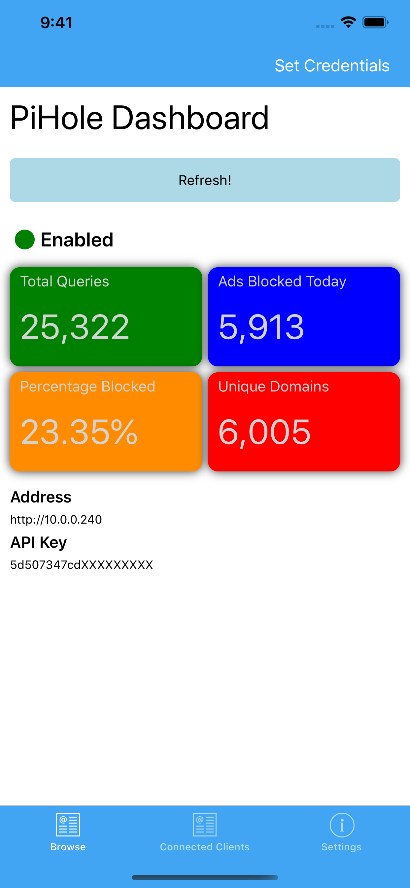
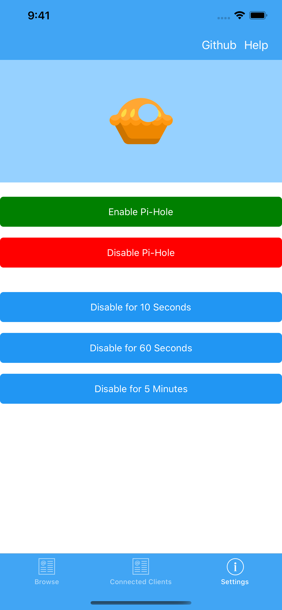
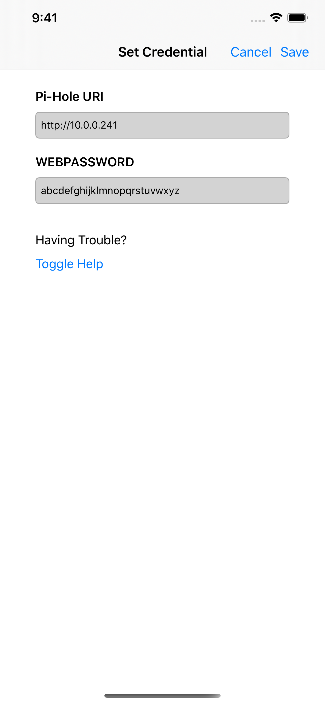

# pihole-dashboard
A simple [Xamarin Forms Shell](https://docs.microsoft.com/en-us/xamarin/xamarin-forms/app-fundamentals/shell/) app to manage your local [Pi-hole](https://pi-hole.net/) instance. 

The idea of this app is to provide "quick toggles" and display information that would be useful "at a glance". My goal is *not* to reach parity with the (awesome) web app that already exists.  Use cases include:

1. Allow less technically inclined/interested people to disable your home's pi-hole temporarily.
2. Ensure your pi-hole instance is up and running.
3. Check that a given device is routing through pi-hole.

Feel free to [open an issue](https://github.com/joshspicer/pihole-mobile-app/issues) for any ideas/concerns, after checking out the [feature road map](https://github.com/joshspicer/pihole-mobile-app/projects/1).  **Pull requests are welcomed and encouraged!**

<kbd>
  
</kbd>
<kbd>
  
</kbd>
<kbd>
  
</kbd>

## Usage

### App Store (iPhone)

This app is available on the iOS app store under the name [Pi ContrHOLE](https://apps.apple.com/us/app/pi-contrhole/id1507963158).  

### Build yourself (iPhone/Android)

Download, [Visual Studio 2019 (Mac/Windows)](https://visualstudio.microsoft.com/), open the `.sln` file, and build for the appropriate device (ios/android).

## Note

You will need the `WEBPASSWORD` found under `/etc/pihole/setupVars.conf` for anything in "Settings". For more details check [here](/help). 

The API token for this app is NOT the one found in the web GUI, nor is it your login password. The API utilized is outlined [here](https://discourse.pi-hole.net/t/pi-hole-api/1863).

